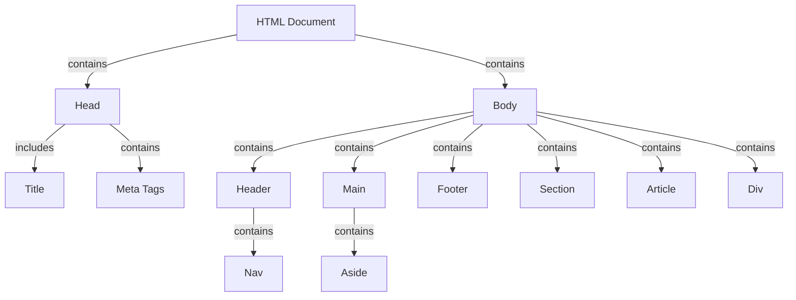

```mermaid
%%{init: {'theme': 'default'}}%%
graph TD;
    A[HTML Document] -->|contains| B[Head]
    A -->|contains| C[Body]
    B -->|includes| D[Title]
    B -->|contains| E[Meta Tags]
    C -->|contains| F[Header]
    C -->|contains| G[Main]
    C -->|contains| H[Footer]
    C -->|contains| I[Section]
    C -->|contains| J[Article]
    C -->|contains| K[Div]
    F -->|contains| L[Nav]
    G -->|contains| M[Aside]
```